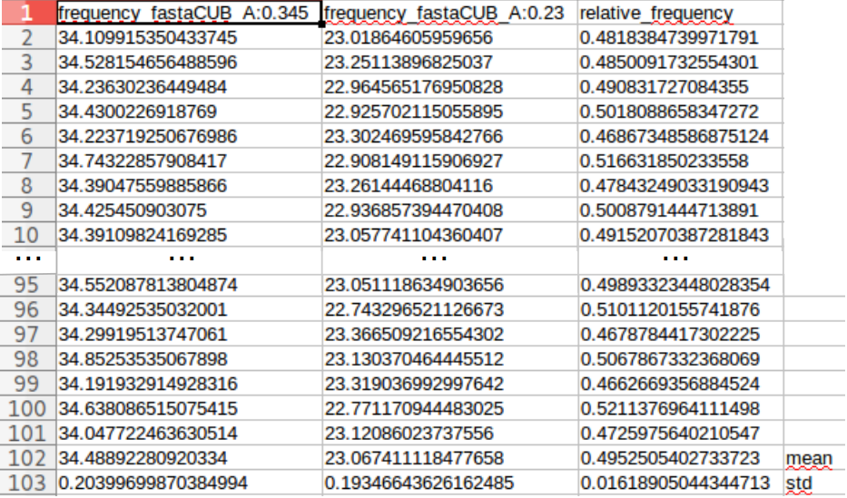

Random fasta comparater's documentation
=======================================

Prerequisites
--------------

**Before launching anything a file named** ``src/config.py`` **with the following content:**

.. code-block:: python

  #!/usr/bin/env  python3

  path = <your_path>

  fgdfre = "%s/fasta_generator_dinucleotide_from_real_exon.py" % path
  fg = "%s/fasta_generator.py" % path
  fgfre = "%s/fasta_generator_from_real_exons.py" % path
  frg = "%s/fasta_reverse_generator.py" % path
  fg2fre = "%s/fasta_generator_2features_real_exons_.py" % path

Where `<your_path>` corresponds to the folder containing the scripts ``fasta_generator_dinucleotide_from_real_exon.py``,  ``fasta_generator.py``, ``fasta_generator_from_real_exons.py``, ``fasta_reverse_generator.py`` and ``fasta_generator_2features_real_exons_.py``

This program uses `python <https://www.python.org>`_ version ``3.5`` and this following dependencies:
  * `os <https://docs.python.org/2/library/os.html>`_ : to test whether a file or a dir exist and to create dir
  * `argparse <https://pypi.python.org/pypi/argparse>`_ : for parser creation
  * `subprocess <https://docs.python.org/2/library/subprocess.html>`_ : to spawn new process
  * `Biopython <http://biopython.org/>`_ : to read fasta file
  * `sys <https://docs.python.org/2/library/sys.html>`_
  * `numpy <http://www.numpy.org/>`_

Description
-----------

The goal of this script is to:
 1. Create a lot of random fasta enriched in a particular unit (*nucleotide*, *di-nucleotide* or *feature*) and calculates the mean frequency of this unit in the fasta file
 2. Create a lot of random fasta impoverished in **the same unit** (*nucleotide*, *di-nucleotide* or *feature*) and calculates the mean frequency of this unit in the fasta file

And then compare their frequency for this unit for each couple of random fasta enriched and impoverished \
(for this unit). To compare their frequency, the relative frequency is computed

The relative frequency is calculated as follow:

.. math::

  F_{relative} = \frac{F_{interest} - F_{control}}{F_{control}}

.. note::

  The random fasta scripts are computed thank to another program normaly localized in the following folder ``fasta_generator/src/``

Where:
  * :math:`F_{relative}` is the relative frequency of a unit :math:`F`
  * :math:`F_{interest}` is the frequency of :math:`F` in the interest set of exons
  * :math:`F_{control}` is the frequency of :math:`F` in the control sets of exons

We then calculate the mean and the standard deviation of:
    1. The list of frequencies in **unit** obtained by creating random fasta files enriched in this **unit**
    2. The list of frequencies in **unit** obtained by creating random fasta files impoverished in this **unit**
    3. The list of relative frequencies between random fasta files enriched and impoverished in this **unit**

Example
#######

For example if we want to generate  100 fasta files having:
  * A high content of **A** nucleotide : :math:`freq_{high}(A)=0.345`
  * A low content of **A** nucleotide : :math:`freq_{low}(A)=0.24`

We must execute this command line :

.. code-block:: bash

  python3 src/random_fasta_comparsion_high_N_low.py --type_unit nt --unit A --freq_high 0.345 --freq_low 0.23 --output result/ --iteration 100 --iscub True

This will create a file in the ``result/`` folder named : ``nt_A_frequency_comparison_between_100_CUB_fasta_file-high:0.345_low:0.23.tsv``

The content of this file is displayed below:

  Content of the result file

.. note::
  1. The 2 last lines corresponds to the mean and the standart deviation of each column.
  2. The first column (exept the 2 last lines) corresponds to the mean frequency of sequences in fasta file having an high content of **A** (:math:`freq_{high}(A)=0.345`)
  3. The second column (exept the 2 last lines) corresponds to the mean frequency of sequences in fasta file having an low content of **A** (:math:`freq_{low}(A)=0.24`)
  4. The third and last column (exept the 2 last lines) correspond the the relative frequency : :math:`F_{relative} = \frac{F_{interest} - F_{control}}{F_{control}}`

Usage
-----

To see how this program works, you can execute:

.. code-block:: bash

  python src/random_fasta_comparsion_high_N_low.py --help

Executed command to populate the result folder
----------------------------------------------

.. code-block:: bash

  mkdir result/frequency_explorer_feature_4enrichment_in_nt.dnt
  python3 src/random_fasta_comparsion_high_N_low.py --type_unit nt --unit A --freq_high 0.345 --freq_low 0.23 --output result/frequency_explorer_feature_4enrichment_in_nt.dnt/ --iteration 100 --iscub True --type_unit_interest feature,feature --unit_interest Hydrophilic#1,Hydrophobic#1
  python3 src/random_fasta_comparsion_high_N_low.py --type_unit nt --unit C --freq_high 0.29 --freq_low 0.21 --output result/frequency_explorer_feature_4enrichment_in_nt.dnt/ --iteration 100 --iscub True --type_unit_interest feature,feature,feature --unit_interest Polar-uncharged#2,Neutral,Charged#2
  python3 src/random_fasta_comparsion_high_N_low.py --type_unit nt --unit C --freq_high 0.29 --freq_low 0.21 --output result/frequency_explorer_feature_4enrichment_in_nt.dnt/ --iteration 100 --iscub True --type_unit_interest feature,feature --unit_interest Hydroxylic,Negatively-charged

  python3 src/random_fasta_comparsion_high_N_low.py --type_unit nt --unit S --freq_high 0.53 --freq_low 0.47 --output result/frequency_explorer_feature_4enrichment_in_nt.dnt/ --iteration 100 --iscub True --type_unit_interest feature,feature,feature --unit_interest Very-small,Small#2,Large
  python3 src/random_fasta_comparsion_high_N_low.py --type_unit nt --unit Y --freq_high 0.491 --freq_low 0.46 --output result/frequency_explorer_feature_4enrichment_in_nt.dnt/ --iteration 100 --iscub True --type_unit_interest feature,feature --unit_interest Hydroxylic,Negatively-charged
  python3 src/random_fasta_comparsion_high_N_low.py --type_unit nt --unit M --freq_high 0.53 --freq_low 0.51 --output result/frequency_explorer_feature_4enrichment_in_nt.dnt/ --iteration 100 --iscub True --type_unit_interest feature,feature --unit_interest Hydroxylic,Negatively-charged

  python3 src/random_fasta_comparsion_high_N_low.py --type_unit dnt --unit TC --freq_high 0.065 --freq_low 0.055 --output result/frequency_explorer_feature_4enrichment_in_nt.dnt/ --iteration 100 --iscub True --type_unit_interest feature,feature --unit_interest Hydroxylic,Negatively-charged
  python3 src/random_fasta_comparsion_high_N_low.py --type_unit dnt --unit AC --freq_high 0.061 --freq_low 0.051 --output result/frequency_explorer_feature_4enrichment_in_nt.dnt/ --iteration 100 --iscub True --type_unit_interest feature,feature --unit_interest Hydroxylic,Negatively-charged

  python3 src/random_fasta_comparsion_high_N_low.py --type_unit nt --unit A --freq_high 0.345 --freq_low 0.23 --output result/frequency_explorer_feature_4enrichment_in_nt.dnt/ --iteration 100 --iscub False --type_unit_interest feature,feature --unit_interest Hydrophilic#1,Hydrophobic#1
  python3 src/random_fasta_comparsion_high_N_low.py --type_unit nt --unit C --freq_high 0.29 --freq_low 0.21 --output result/frequency_explorer_feature_4enrichment_in_nt.dnt/ --iteration 100 --iscub False --type_unit_interest feature,feature,feature --unit_interest Polar-uncharged#2,Neutral,Charged#2
  python3 src/random_fasta_comparsion_high_N_low.py --type_unit nt --unit C --freq_high 0.29 --freq_low 0.21 --output result/frequency_explorer_feature_4enrichment_in_nt.dnt/ --iteration 100 --iscub False --type_unit_interest feature,feature --unit_interest Hydroxylic,Negatively-charged

  python3 src/random_fasta_comparsion_high_N_low.py --type_unit nt --unit S --freq_high 0.53 --freq_low 0.47 --output result/frequency_explorer_feature_4enrichment_in_nt.dnt/ --iteration 100 --iscub False --type_unit_interest feature,feature,feature --unit_interest Very-small,Small#2,Large
  python3 src/random_fasta_comparsion_high_N_low.py --type_unit nt --unit Y --freq_high 0.491 --freq_low 0.46 --output result/frequency_explorer_feature_4enrichment_in_nt.dnt/ --iteration 100 --iscub False --type_unit_interest feature,feature --unit_interest Hydroxylic,Negatively-charged
  python3 src/random_fasta_comparsion_high_N_low.py --type_unit nt --unit M --freq_high 0.53 --freq_low 0.51 --output result/frequency_explorer_feature_4enrichment_in_nt.dnt/ --iteration 100 --iscub False --type_unit_interest feature,feature --unit_interest Hydroxylic,Negatively-charged

  python3 src/random_fasta_comparsion_high_N_low.py --type_unit dnt --unit TC --freq_high 0.065 --freq_low 0.055 --output result/frequency_explorer_feature_4enrichment_in_nt.dnt/ --iteration 100 --iscub False --type_unit_interest feature,feature --unit_interest Hydroxylic,Negatively-charged
  python3 src/random_fasta_comparsion_high_N_low.py --type_unit dnt --unit AC --freq_high 0.061 --freq_low 0.051 --output result/frequency_explorer_feature_4enrichment_in_nt.dnt/ --iteration 100 --iscub False --type_unit_interest feature,feature --unit_interest Hydroxylic,Negatively-charged

  mkdir result/frequency_explorer_nt_4enrichment_in_feature
  python3 src/random_fasta_comparsion_high_N_low.py --type_unit feature --unit Hydrophilic#1 --freq_high 0.4 --freq_low 0.26 --output result/frequency_explorer_nt_4enrichment_in_feature/ --iteration 100 --iscub False  --type_unit_interest nt,dnt --unit_interest A,AA
  python3 src/random_fasta_comparsion_high_N_low.py --type_unit feature --unit Small#2 --freq_high 0.44 --freq_low 0.41 --output result/frequency_explorer_nt_4enrichment_in_feature/ --iteration 100 --iscub False  --type_unit_interest nt,dnt --unit_interest S,GC
  python3 src/random_fasta_comparsion_high_N_low.py --type_unit feature --unit Very-small --freq_high 0.27 --freq_low 0.21 --output result/frequency_explorer_nt_4enrichment_in_feature/ --iteration 100 --iscub False  --type_unit_interest nt,dnt --unit_interest S,GC
  python3 src/random_fasta_comparsion_high_N_low.py --type_unit feature --unit Polar-uncharged#2 --freq_high 0.29 --freq_low 0.25 --output result/frequency_explorer_nt_4enrichment_in_feature/ --iteration 100 --iscub False  --type_unit_interest nt,dnt --unit_interest C,CC
  python3 src/random_fasta_comparsion_high_N_low.py --type_unit feature --unit Neutral --freq_high 0.38 --freq_low 0.31 --output result/frequency_explorer_nt_4enrichment_in_feature/ --iteration 100 --iscub False  --type_unit_interest nt,dnt --unit_interest C,CC
  python3 src/random_fasta_comparsion_high_N_low.py --type_unit feature --unit Hydroxylic --freq_high 0.19 --freq_low 0.17 --output result/frequency_explorer_nt_4enrichment_in_feature/ --iteration 100 --iscub False --type_unit_interest nt,dnt --unit_interest C,CC

  python3 src/random_fasta_comparsion_high_N_low.py --type_unit feature --unit Hydrophilic#1 --freq_high 0.4 --freq_low 0.26 --output result/frequency_explorer_nt_4enrichment_in_feature/ --iteration 100 --iscub True  --type_unit_interest nt,dnt --unit_interest A,AA
  python3 src/random_fasta_comparsion_high_N_low.py --type_unit feature --unit Small#2 --freq_high 0.44 --freq_low 0.41 --output result/frequency_explorer_nt_4enrichment_in_feature/ --iteration 100 --iscub True  --type_unit_interest nt,dnt --unit_interest S,GC
  python3 src/random_fasta_comparsion_high_N_low.py --type_unit feature --unit Very-small --freq_high 0.27 --freq_low 0.21 --output result/frequency_explorer_nt_4enrichment_in_feature/ --iteration 100 --iscub True  --type_unit_interest nt,dnt --unit_interest S,GC
  python3 src/random_fasta_comparsion_high_N_low.py --type_unit feature --unit Polar-uncharged#2 --freq_high 0.29 --freq_low 0.25 --output result/frequency_explorer_nt_4enrichment_in_feature/ --iteration 100 --iscub True  --type_unit_interest nt,dnt --unit_interest C,CC
  python3 src/random_fasta_comparsion_high_N_low.py --type_unit feature --unit Neutral --freq_high 0.38 --freq_low 0.31 --output result/frequency_explorer_nt_4enrichment_in_feature/ --iteration 100 --iscub True  --type_unit_interest nt,dnt --unit_interest C,CC
  python3 src/random_fasta_comparsion_high_N_low.py --type_unit feature --unit Hydroxylic --freq_high 0.19 --freq_low 0.17 --output result/frequency_explorer_nt_4enrichment_in_feature/ --iteration 100 --iscub True --type_unit_interest nt,dnt --unit_interest C,CC

  mkdir result/frequency_explorer_nt_4enrichment_in_2features
  python3 src/random_fasta_dependant_feature_high_N_low.py --type_unit feature --unit Small#2,Large --freq_high 0.44,0.34 --freq_low 0.41,0.38 --output result/frequency_explorer_nt_4enrichment_in_2features --iteration 100 --type_unit_interest nt,dnt --unit_interest S,GC
  python3 src/random_fasta_dependant_feature_high_N_low.py --type_unit feature --unit Very-small,Large --freq_high 0.27,0.34 --freq_low 0.21,0.38 --output result/frequency_explorer_nt_4enrichment_in_2features --iteration 100 --type_unit_interest nt,dnt --unit_interest S,GC
  python3 src/random_fasta_dependant_feature_high_N_low.py --type_unit feature --unit Polar-uncharged#2,Charged#2 --freq_high 0.29,0.17 --freq_low 0.25,0.26 --output result/frequency_explorer_nt_4enrichment_in_2features --iteration 100 --type_unit_interest nt,dnt --unit_interest C,CC
  python3 src/random_fasta_dependant_feature_high_N_low.py --type_unit feature --unit Neutral,Charged#2 --freq_high 0.38,0.17 --freq_low 0.31,0.26 --output result/frequency_explorer_nt_4enrichment_in_2features --iteration 100 --type_unit_interest nt,dnt --unit_interest C,CC
  python3 src/random_fasta_dependant_feature_high_N_low.py --type_unit feature --unit Hydrophilic#1,Hydrophobic#1  --freq_high 0.4,0.33 --freq_low 0.26,0.39 --output result/frequency_explorer_nt_4enrichment_in_2features --iteration 100 --type_unit_interest nt,dnt --unit_interest A,AA
